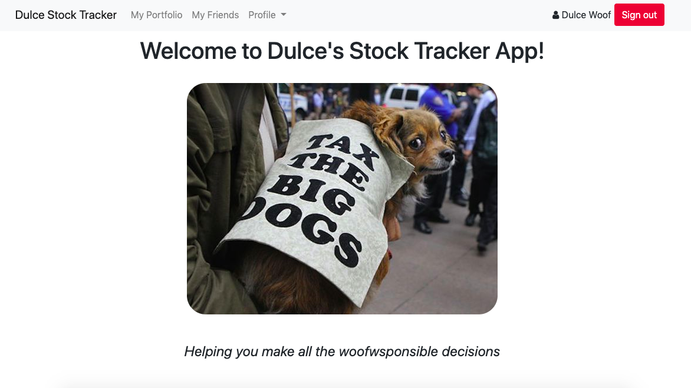
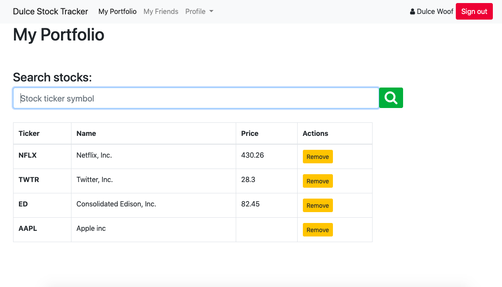
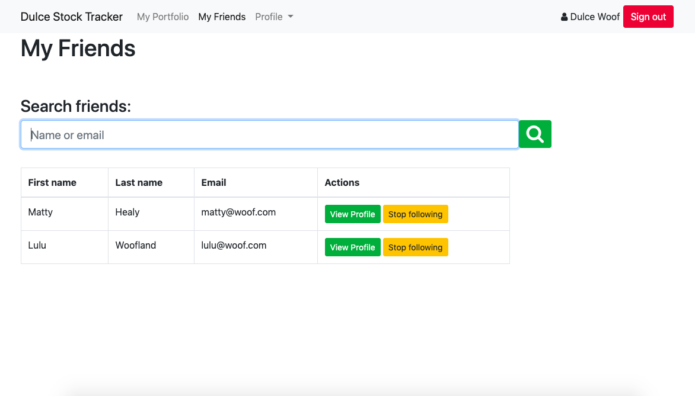

# 💻 Dulce's Stock Tracker

Responsive web application to help you keep a track of your stocks :chart:.
Built with Rails 6 and Ruby 2.7.0.





Users can:
- Sign up, login and logout.
- Edit their profile.
- Track up to 10 stocks per user. They'll be displayed at their profile page.
- Search for stocks, add and remove from their portfolio.
- Look for friends or other users, by name or email.
- View the stocks' portfolio of their friends to get investing ideas.

## ✨ Live Demo

You can look at it [here](https://dulce-stock-tracker.herokuapp.com/).


## 🚀 Getting Started

To get a local copy up and running follow these simple example steps.


### Clone

```sh
git clone git@github.com:misselliev/stock-tracker.git
cd stock-tracker
```

### Install

```sh
bundle install 
```

### Usage

```sh
rails server
```
## :pencil2: Todo
- Tests to be added.

## Author

👤 Elizabeth Villalejos

- [Github](https://github.com/misselliev)
- [Linkedin](https://linkedin.com/ellievillalejos)
- [Dev.to](https://dev.to/misselliev)
- [Twitter](https://twitter.com/miss_elliev/)
- [Instagram](https://www.instagram.com/miss_elliev/)
- [Email](mailto:elizabeth.villalejos@gmail.com?subject=Website%20Inquiry)


## 🤝 Contributing

Contributions, issues and feature requests are welcome!

Feel free to check the [issues page](issues/).


## Show your support

Give a ⭐️ if you like this project!

> “What simple action could you take today to produce a new momentum toward success in your life?” Tony Robbins

